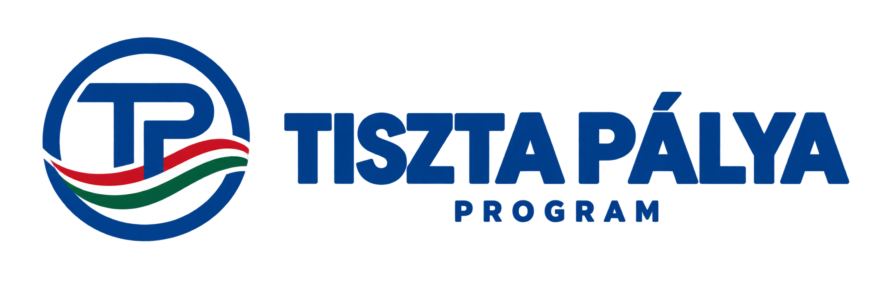

  

# Tiszta Pálya Program

A magyar férfi professzionális klubfutball fenntarthatóbb, átláthatóbb és közösségibb működésének konzultációs vizsgálati kerete.

## Aktuális kiadás

**0.9.2-j1 - javított konzultációs változat, 2026. szeptember 22.**  
**Szerző: Kiss Tiborcz**

- [Teljes konzultációs dokumentum, PDF (27 oldal)](dokumentumok/Tiszta_Palya_Program_konzultacios_valtozat_0_9_2_j1.pdf)
- [Kereshető teljes szöveg, TXT](dokumentumok/Tiszta_Palya_Program_konzultacios_valtozat_0_9_2_j1.txt)
- [Egyoldalas vezetői összefoglaló](VEZETOI_OSSZEFOGLALO.md) és [nyomtatható PDF](dokumentumok/Tiszta_Palya_Program_vezetoi_osszefoglalo_0_9_2_j1.pdf)
- [Ellenőrizhető pénzügyi példa](PENZUGYI_MODELL.md)
- [Módszertan és mutatódefiníciók](METODIKA_ES_MUTATOK.md)

## Mi javult?

A pénzügyi példa azonos 0. évi bázisból indul, és külön eredmény-, költség-, pénzforgalmi és finanszírozásihiány-táblát tartalmaz. Az eladási eredmény képlete a kivezetéskori könyv szerinti értéket használja; a beszerzési érték és az amortizáció nem kerül kétszer levonásra. A KPI-k és a rövid pilot értelmezési korlátai pontosabbak, a PDF és a kísérőfájlok verziójelölése egységes.

A 0.9.2-j1 a korábbi konzultációs anyag javítása. A 0.9.3-as esettanulmány külön előkészítés alatt áll; ez a kiadás nem annak lezárása.

## Bizonyítottsági státusz

A konzultációs kiadás pénzügyi számpéldájának értékei modellfeltételezések, nem auditált klubadatok és nem előrejelzések. A külön kutatási helyzetjelentések a nyilvános klubbeszámolók előzetes feldolgozásáról számolnak be, saját ellenőrzési státusszal; a felhasznált források lenyomatát a [forrásjegyzék](FORRASJEGYZEK.md) közli, hogy a forrás azonossága külső ellenőrzéssel is visszakövethető legyen.

A forrás azonosságának igazolása **nem** az adatátvétel vagy a modell igazolása. A kutatási rekordok emberi és független szakmai felülvizsgálata még nem történt meg. A négy pillér együttes hatása és az önálló gazdálkodásra való átállás megvalósíthatósága nincs igazolva. A módszertani pontosítás nem külső szakmai jóváhagyás.

## Kutatási helyzetjelentések

- **[2026. szeptember 23. – forrásintegritás és az MTK bevételi feltárása](KUTATASI_STATUSZ_2026-09-23.md)**
- [2026. szeptember 22. – háromklubos előzetes feltárás](KUTATASI_STATUSZ.md)

Elkészült az FTC, a Puskás Akadémia és az MTK labdarúgó-társaságának 2022–2024-es éves beszámolóira épülő előzetes pénzügyi feldolgozás. A szervezeti körök, bevételi besorolások és sportági időszakok eltérései miatt további egyeztetés szükséges. Az adatátvétel AI-val támogatott; független szakmai felülvizsgálata még hátravan.

A kutatás 23 nyilvános dokumentumból dolgozik. Mindegyikhez közöljük a közzétételi helyet, a letöltés napját és a SHA-256 lenyomatot, hogy a forrás azonossága **külső ellenőrzéssel is visszakövethető** legyen.

- [Elsődleges forrásjegyzék és forrásintegritás](FORRASJEGYZEK.md)

Ezek kutatási státuszfrissítések; az aktuális konzultációs kiadás továbbra is **0.9.2-j1**.

## Átláthatóság és további munka

- [Állítás-forrás mátrix](ALLITAS_FORRAS_MATRIX.md)
- [Változásnapló](CHANGELOG.md)
- [Döntési napló](DONTESI_NAPLO.md)
- [Felhasználási és módszertani nyilatkozat](FELHASZNALASI_ES_MODSZERTANI_NYILATKOZAT.md)

Következő lépések: szakmai és jogi visszajelzés feldolgozása, összehasonlítható klubadatok gyűjtése, a feltételezések kalibrálása, majd önkéntes megvalósíthatósági pilot tervezése. A 6-12 hónapos pilot és a 3-5 éves utánkövetés külön feladat.

## Korábbi kiadások és újraszámítás

A `0_9` és `0_9_2` nevű korábbi PDF-ek történeti változatok; ismert hibáikat a jelen kiadás javítja. Új szakmai egyeztetéshez a fenti 0.9.2-j1 fájlok használandók. A régi fájlokat és hivatkozásokat a verziótörténet követhetősége miatt megőriztük.

A pénzügyi bemenetek a [modellparaméterekben](modellek/penzugyi_pelda_0_9_2_j1.json) találhatók. A [kiadás előállítója](scripts/build_revision_092_j1.py) a pénzügyi táblákat, a kereshető szöveget és a PDF-eket is elkészíti. Futtatás: `python scripts/build_revision_092_j1.py`; függőségek: PyMuPDF, ReportLab és DejaVu Sans fontok. Az előállító a megőrzött alap-PDF és a rögzített modellbemenet azonosságát is ellenőrzi. Ez a konkrét kiadás újra-előállítója; módosított paraméterekhez új verzió és a szöveges következtetések felülvizsgálata szükséges.

Észrevétel a repó Issues felületén is rögzíthető.

